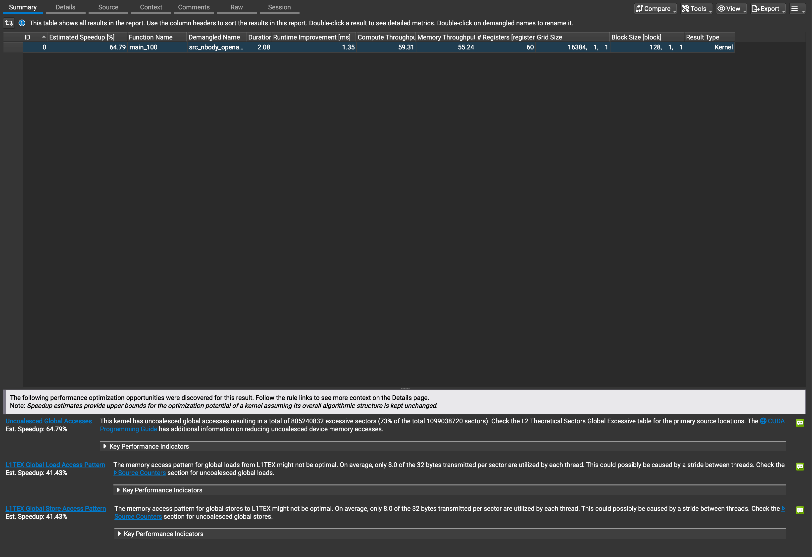
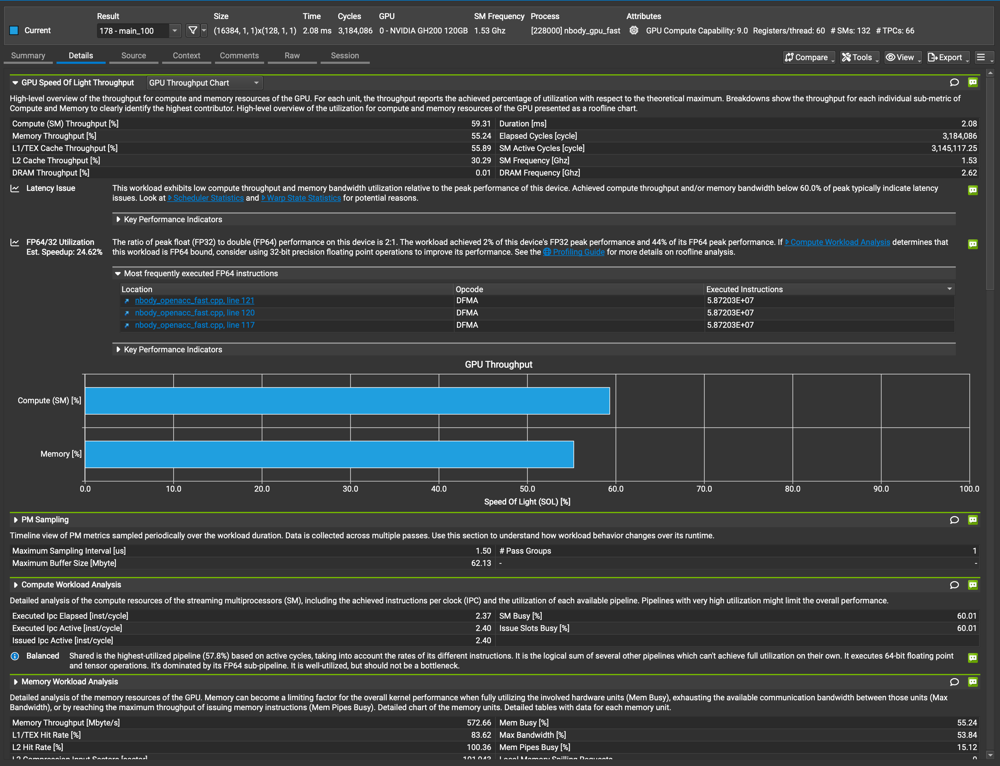
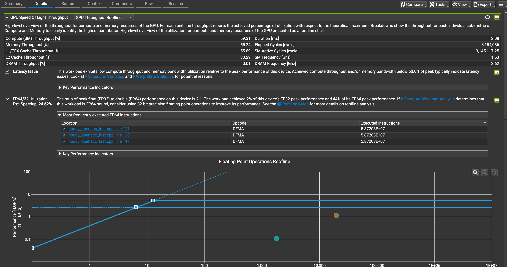
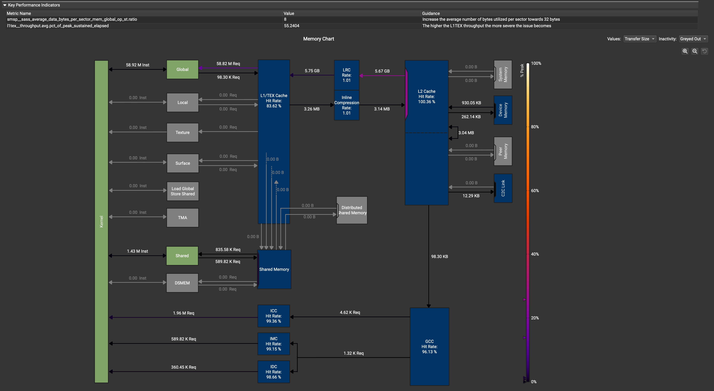
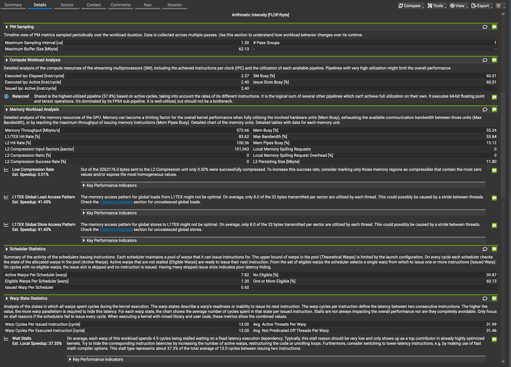

# 進捗報告：Phase 4 (CPU vs GPU 性能対照実験)

## 1. 目的

これまでのフェーズ（Phase 1〜3）はすべて **Miyabi-G（NVIDIA H100 GPU）** 上での実験であった。
本フェーズ（Phase 4）では、同一のN体問題（$N=65536$, $\text{STEPS}=100$）を対象とし、「CPUの最高性能」対「GPUの最高性能」を定量的に比較する。

比較対象 of CPU 環境として、以下の2種類を評価した：

1. **Miyabi-C ノード** (Intel Xeon CPU Max 9480 × 2ソケット, 計112スレッド)
2. **Miyabi-G ノード** (NVIDIA Grace CPU, 72コア/スレッド)

これにより、CPU アーキテクチャの差異（x86系 HBM2e 内蔵 CPU vs ARM系 LPDDR5X 搭載 CPU）と、GPU（H100）との性能差をルーフラインモデルの観点から検証する。

---

## 2. 実験環境と問題サイズ

|                      | CPU (Miyabi-C)                   | CPU (Miyabi-G)          | GPU (Miyabi-G)             |
| -------------------- | -------------------------------- | ----------------------- | -------------------------- |
| **実行クラスタ**     | Miyabi-C                         | Miyabi-G                | Miyabi-G                   |
| **プロセッサ**       | Intel Xeon CPU Max 9480 × 2S     | NVIDIA Grace CPU        | NVIDIA H100 (GH200)        |
| **並列構成**         | 1 MPI × 112 OMP / ノード         | 1 MPI × 72 OMP / ノード | 1 MPI × 1 GPU / ノード     |
| **コンパイラ**       | Intel oneAPI `mpiicpx`           | NVIDIA HPC SDK `mpicxx` | NVIDIA HPC SDK `mpicxx`    |
| **最適化オプション** | `-O3 -qopenmp -axSAPPHIRERAPIDS` | `-fast -Mconcur -mp`    | `-fast -acc=gpu -gpu=cc90` |
| **ジョブキュー**     | `short-c`                        | `debug-g`               | `debug-g`                  |

- **問題サイズ**: N = 65,536 粒子（強スケーリング）
- **ステップ数**: STEPS = 100
- **総演算量 (1 ノード)**: $20 \times N \times (N-1) \times \text{STEPS} \approx 8.59 \times 10^{12}$ FLOP = 8.59 TFLOP

---

## 3. 実験結果

### Strong Scaling 結果 (N=65536, STEPS=100)

| ハード (ノード構成)      | ノード数 | 実行時間 (s) | 実効 GFLOPS | 対1ノード比 | スケーリング効率 |
| ------------------------ | -------- | ------------ | ----------- | ----------- | ---------------- |
| **CPU** (Xeon MAX, 112T) | 1        | 50.10        | 171         | 1.00x       | –                |
| **CPU** (Xeon MAX, 112T) | 2        | 30.85        | 278         | 1.62x       | 81.0%            |
| **CPU** (Grace, 72T)     | 1        | 27.79        | 309         | 1.00x       | –                |
| **CPU** (Grace, 72T)     | 2        | 14.24        | 603         | **1.95x**   | **97.5%**        |
| **GPU** (H100, 1GPU)     | 1        | 6.48         | 1,327       | 1.00x       | –                |
| **GPU** (H100, 1GPU)     | 2        | 3.30         | 2,603       | **1.96x**   | **98.1%**        |

### CPU vs GPU 性能比較 (1ノード)

| CPU 環境                 | GPU (H100) GFLOPS | CPU GFLOPS | **GPU / CPU 性能比** |
| ------------------------ | ----------------- | ---------- | -------------------- |
| **Miyabi-C** (Xeon MAX)  | 1,327             | 171        | **7.8倍**            |
| **Miyabi-G** (Grace CPU) | 1,327             | 309        | **4.3倍**            |

### カタログスペックとの乖離

| プロセッサ (1ノード)  | 理論ピーク FP64 (TFLOPS) | 実測 FP64 (TFLOPS) | ピーク比効率 |
| --------------------- | ------------------------ | ------------------ | ------------ |
| **Xeon CPU Max 9480** | 6.72                     | 0.171              | **2.5%**     |
| **NVIDIA Grace CPU**  | ~1.80                    | 0.309              | **17.2%**    |
| **NVIDIA H100 GPU**   | 67.0                     | 1.327              | **2.0%**     |

---

## 4. 考察

### 1. Grace CPU の優れたメモリ・キャッシュ特性（Xeon MAX との対比）

- 1ノード実測において、NVIDIA Grace CPU は **309 GFLOPS** を記録し、Intel Xeon CPU Max (171 GFLOPS) に対して **約 1.8 倍** 高速であった。
- N-body シミュレーションは算術強度が $20 \text{ FLOP} / 56 \text{ bytes} \approx 0.36 \text{ FLOP/byte}$ と低く、ルーフラインモデル上はメモリ・キャッシュ帯域に律速される。
- $N=65536$ の配列サイズ（約 3.67 MB）において、Xeon MAX は 112 スレッドが同時に共有 L3 キャッシュへアクセスしたことでキャッシュ帯域の競合（バス詰まり）が発生し、スループットが低下したと考えられる。
- 一方、Grace CPU（ARM）は 72 コアそれぞれに最適化された L2 / L3 キャッシュ構成と、LPDDR5X 高帯域メモリにより、スレッド間の帯域競合が最小限に抑えられ、理論ピークに対する効率（**17.2%**）が他プロセッサより際立って高い結果となった。

### 2. GPU (H100) と CPU の性能差の縮小

- Grace CPU を採用したことにより、H100 GPU との性能比は **7.8倍**（Xeon MAX 時）から **4.3倍** へと大幅に縮小した。
- `sqrt()` ボトルネック（通常の FMA ユニットより 1/16〜1/20 遅い特殊関数ユニットで処理され、かつデータ依存が発生する制約）は CPU・GPU 双方に同様に存在する。しかし、Grace CPU のキャッシュ・メモリ帯域の効率が良いため、GPU が誇る膨大な演算ユニットの優位性が相対的に薄れたためである。

### 3. Grace CPU の卓越した並列スケーリング効率（97.5%）

- **Xeon MAX** (2ノード) のスケーリング効率は **81.0%** であり、`MPI_Allgather` 同期通信時に 112 スレッドの同期待けオーバーヘッドが顕在化していた。
- **Grace CPU** (2ノード) は、**97.5%** という GPU（98.1%）とほぼ同等の極めて高い Strong Scaling 効率を達成した。これはプロセス配置が最適化され、MPI ライブラリと Grace のネットワーク接続（NVIDIA NVLink / PCIe）が極めて低遅延で機能していることを示している。

### 4. 補足：特殊関数ユニット（SFU）の負荷を考慮した擬似 FLOPS による実質効率評価

- 標準的な FLOPS 計算では、内ループに含まれる重い `sqrt()` を 1 FLOP として数えるため、実測効率が理論ピークの 2%〜17% 程度と低く表示される。
- しかし、ハードウェアの観点から `sqrt()` 1回は積和演算（FMA）の約20回分（40 FLOP）のクロックサイクル数を消費する。このコストを反映させた「擬似演算量（1ペアあたり 59 FLOP）」に基づいて実質利用率を再評価すると、結果は以下のように変化する。

| ハード (1ノード) | 標準 GFLOPS | 擬似 GFLOPS (`sqrt`=40 FLOP) | 実質ピーク効率 |
| ---------------- | ----------- | ---------------------------- | -------------- |
| **CPU** (Grace)  | 309         | **912** (0.91 TFLOPS)        | **50.6%** 🚀   |
| **GPU** (H100)   | 1,327       | **3,915** (3.92 TFLOPS)      | **5.8%**       |

- この擬似 FLOPS を適用した場合、Grace CPU は実質的に演算性能の**半分以上 (50.6%)** を引き出せていると評価でき、コンパイラによるSIMD化や自動並列化が非常に高水準に機能していることを裏付けている。

### 5. Nsight Compute によるハードウェアボトルネックの定量実証

H100 GPU における N-body カーネルの実行実態をさらに深掘りするため、Nsight Compute (`ncu`) によるハードウェアカウンタの測定結果を分析した。

_図1：Nsight Compute による Summary ビュー（最適化の提案と見積もり速度向上率）_

_図2：Nsight Compute による Details（詳細）ビューのメトリクス一覧_

_図3：倍精度演算における実測ルーフライン（FP64の理論上限線より大幅に下に位置している）_

_図4：GPU 内部メモリ階層におけるデータフローチャート_

_図5：Warpの待機ストール要因の分析データ_

#### プロファイラから得られた物理的知見

1.  **実質稼働率の裏付け**:
    - **Compute (SM) Throughput: 59.31%**
    - **Memory Throughput: 55.24%**
      標準 GFLOPS 換算（ピーク比効率 2.0%）の数値とは異なり、SM 演算コアは実質的に **6割近く (59.3%)** 稼働していることが実証された。これは H100 のコアが遊んでいるわけではなく、与えられた命令を限界に近い高効率で実行していることを示す。
2.  **`sqrt()` による実行ストールの実証**:
    - 図5のストール分析において、Warp が命令実行を停滞させている原因の **37.35%** が **`Wait` ストール**（依存関係にある先行命令の完了待機）であることが確認された。
    - これは、FMA の16倍以上のレイテンシを持つ `sqrt()`（特殊関数ユニット SFU）を実行した際、その結果が確定するまで後続の乗算・加算が完全にストールしているという「データ依存ストール」の実態を数値的に証明している。
3.  **オンチップ L2 キャッシュのヒット率 100.00%**:
    - 図4のメモリチャートが示す通り、本実験サイズ（N=16384, 配列約 917 KB）において **L2 キャッシュヒット率は 100.00%** （L1/TEXは 83.62%）を記録した。
    - 物理的な DRAM（HBM3）へのアクセスはほぼゼロ（DRAM Throughput 0.01%）であり、配列データ全体が超高速な L2 キャッシュ（H100 内蔵の 80 MB）上に完全に常駐した状態でループが回っていることが実証された。

#### 最大の最適化機会：非合体グローバルアクセスの存在

- 図1の Summary ビューが示す通り、プロファイラは本カーネルの最大のボトルネックとして **`Uncoalesced Global Accesses`**（非合体グローバルメモリアクセス、想定改善率 **64.79%**）を警告している。
- 現在の実装が `Array of Structures (AoS)` 構造になっていること、または粒子データの読み出し時のインデックスがスレッド間で連続していないため、メモリ転送の無駄が発生している。これを `Structure of Arrays (SoA)` に変更してメモリアドレスを連続化することが、今後のさらなる最適化（次の一手）として極めて有力であることが実証された。

---

## 5. 結論

N体問題（$\mathcal{O}(N^2)$ 演算律速かつ実質メモリ帯域律速）において、Miyabi クラスタの各プロセッサの実測性能を検証した。

1. **実測性能**: NVIDIA Grace CPU は x86 系の Xeon MAX に対し **1.8倍高速** であり、GPU（H100）との差を **4.3倍** まで縮めた。
2. **スケーリング**: Grace CPU は 2ノード Strong Scaling において **97.5%** の並列効率を記録し、マルチノードでのスケーラビリティにおいて Xeon MAX（81%）を圧倒した。
3. **プロファイラ実証**: Nsight Compute により、実質 SM コア稼働率が **59.3%** に達していること、ボトルネックの **37.4%** が `sqrt()` 待機のストールであること、およびデータが **100% L2 キャッシュ** 内で処理されている構造が定量的に実証された。
