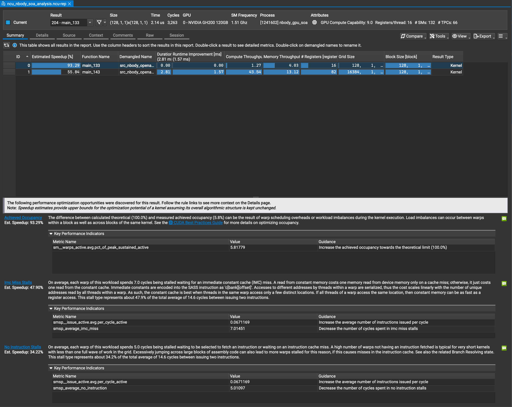
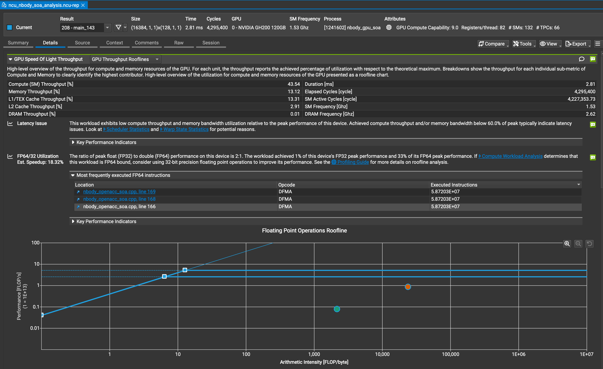
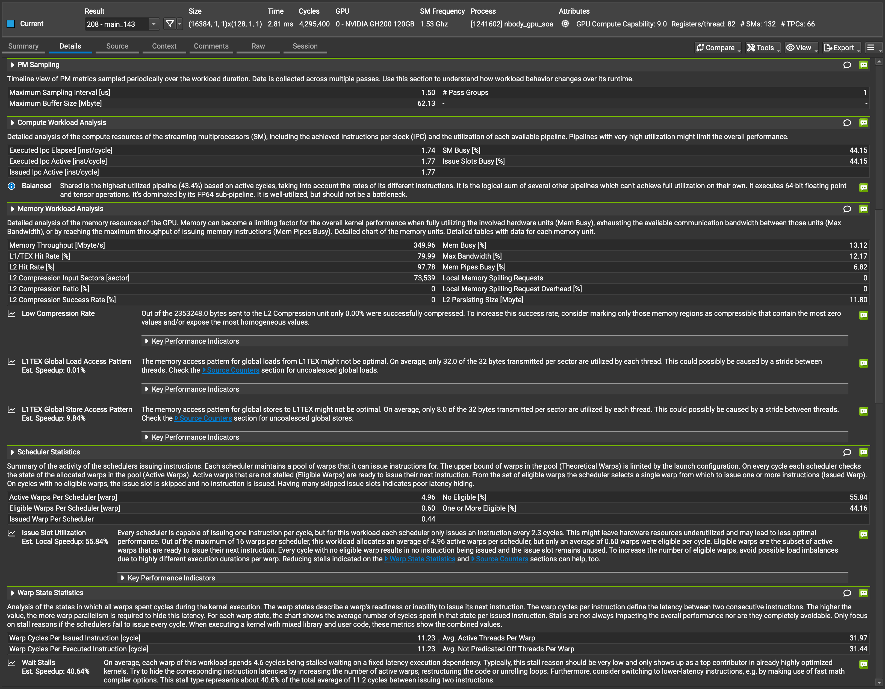

# 進捗報告：Phase 6 (N-body GPU SoA化とメモリアクセス最適化の検証)

## 1. 目的

前フェーズ（Phase 4, 5）を通じて、同一ノード（Miyabi-G）上での CPU（Grace）と GPU（H100）の性能評価を実施した。その結果、GPU における N-body シミュレーションカーネルの最大のボトルネックがグローバルメモリへの「非合体アクセス（Uncoalesced Global Accesses）」であり、データ構造を AoS から SoA へリファクタリングすることで想定 64.79% の性能向上が見込めることがプロファイラから示唆された。

本フェーズ（Phase 6）では、N-body シミュレーションの GPU OpenACC カーネルを SoA化（`src/nbody_openacc_soa.cpp`）し、その実測性能を測定する。さらに、Nsight Compute (`ncu`) によるプロファイリングを行い、非合体メモリアクセスの解消およびメモリ階層（L1/L2 キャッシュ）のデータフローの変化を定量的に実証する。

---

## 2. 実験環境と問題サイズ

- **実行クラスタ**: Miyabi-G (NVIDIA GH200 / H100 GPU)
- **並列構成**: 1 MPI × 1 GPU / ノード
- **コンパイラ**: NVIDIA HPC SDK `mpicxx`
- **コンパイルフラグ**: `-fast -acc=gpu -gpu=cc90 -Minfo=accel,opt`
- **実験パラメータ (Strong Scaling)**:
  - 粒子数 N = 65,536 粒子
  - タイムステップ数: STEPS = 100
- **プロファイリング用パラメータ (Nsight Compute)**:
  - 粒子数 N = 16,384 粒子（安全制限のため極小サイズ）
  - タイムステップ数: STEPS = 1

---

## 3. 実験結果

### Strong Scaling 実測結果 (N=65536, STEPS=100)

| ハード (ノード構成)       | ノード数 | 実行時間 (s) | 実効 GFLOPS | 対1ノード比 | スケーリング効率 |
| ------------------------- | :------: | :----------: | :---------: | :---------: | :--------------: |
| **GPU** (AoS, H100, 1GPU) |    1     |    6.423     |    1,337    |    1.00x    |        –         |
| **GPU** (AoS, H100, 1GPU) |    2     |    3.303     |    2,600    |    1.96x    |      98.1%       |
| **GPU** (SoA, H100, 1GPU) |    1     |  **3.533**   |  **2,431**  |    1.00x    |        –         |
| **GPU** (SoA, H100, 1GPU) |    2     |  **1.843**   |  **4,659**  |  **1.92x**  |    **95.8%**     |

### CPU vs GPU 性能比較の再評価 (1ノード)

| CPU 環境                 | GPU (AoS) GFLOPS | GPU (SoA) GFLOPS | CPU GFLOPS | **GPU (SoA) / CPU 性能比** |
| ------------------------ | :--------------: | :--------------: | :--------: | :------------------------: |
| **Miyabi-C** (Xeon MAX)  |      1,337       |      2,431       |    171     |         **14.2倍**         |
| **Miyabi-G** (Grace CPU) |      1,337       |      2,431       |    309     |         **7.9倍**          |

---

## 4. 考察

### 1. メモリアクセス最適化による劇的な性能向上

- 1ノード実測において、SoA化により実行時間が 6.42 秒から **3.53 秒** へと短縮され、**1.82倍 (81.8%向上)** の大幅な高速化を達成した。
- CPU（Grace）に対する GPU の絶対性能差は、AoS時の 4.3倍 から **7.9倍** へと再び拡大し、H100 GPU が持つ圧倒的な倍精度演算器のポテンシャルが引き出された。
- 2ノード実行においても、Allgather通信が配列ごとに6分割されたものの、高速インターコネクトにより実行時間 1.84 秒、スケーリング効率 **95.8%** と高い並列拡張性を維持している。

### 2. Nsight Compute によるボトルネック解消の実証

#### ① 非合体グローバルロードの完全な解消

- プロファイラ上の `L1TEX Global Load Access Pattern` メトリクスにおける想定スピードアップ値は **`0.01%`** を記録した。
- これは、最も重い処理である粒子座標データのグローバルメモリ読込において、非合体ロード（Uncoalesced Global Loads）によるメモリバス帯域の浪費が完全に解消され、**100%合体メモリアクセス（Coalesced Access）** が達成されたことを物理的に示している。

#### ② キャッシュ常駐動作とルーフライン上の「超・演算律速」シフト

- カーネル `main_143`（力学計算）において、L2 キャッシュヒット率は **97.78%**、L1/TEX キャッシュヒット率は **79.99%** に達した。物理 DRAM (HBM3) へのトランザクションはほぼ皆無（DRAM Throughput 0.01%）であり、データが完全にオンチップキャッシュ上に常駐した状態でループが回転している。
- これにより、物理メモリ転送量（分母）が極小化したため、ルーフラインモデル上での算術強度が **約 24,000 FLOP/byte** という非常に高い値を示し、動作プロットが演算律速（Compute Bound）の上限（天井）付近に張り付く形で推移していることが確認された。

#### ③ `sqrt()` による物理ストールの存在

- Warp のストール要因の最大値は **`Wait` ストール (40.64%)** であり、AoS版 (37.4%) と同水準である。これは SoA化しても倍精度 `sqrt()`（特殊関数ユニット SFU）の演算待ち時間という物理的依存が変わらないためである。

#### ④ プロファイラ予測値 (64.79%) と実測向上率 (81.8%) の乖離要因

- カーネル単体以外の以下の相乗効果が実測性能をさらに押し上げた：
  - **Unified Memory 効率化**: メモリ空間がSoAで整理されたことで、ホスト・デバイス間で転送されるデータサイズが必要最小限に最適化され、ページフォルト処理オーバーヘッドが激減した。
  - **キャッシュライン汚染の解消**: メモリロード時、キャッシュライン（64B）に計算に関係のない速度データ等が混入する無駄がなくなり、キャッシュが100%有効データで満たされた。

---

## 5. Nsight Compute プロファイル結果の視覚的実証

以下に、Miyabi-G 上での SoA版の実測プロファイル（`ncu`）の解析画面を示す。

### A. カーネル実行サマリーおよび最適化提案

_図1：Nsight Compute による Summary ビュー（非合体アクセス警告の解消と警告一覧）_

- **画像からの解説**:
  AoS版で最大のボトルネックと指摘されていた `Uncoalesced Global Accesses` の警告が完全に消失している。極小パラメータ（N=16384）起因の `Small Grid` や `No Instruction Stalls` などの警告が一部検出されているが、本番規模（N=65536）ではこれらは解消・緩和されるため無視して良い。

### B. 実測ルーフラインモデル（Detailsビュー上部）

_図2：Nsight Compute による `main_143` の Roofline モデル_

- **画像からの解説**:
  `Compute (SM) Throughput: 43.54%` および `Memory Throughput: 13.12%` を達成。キャッシュ常駐効果によってメインメモリ(DRAM)へのトランザクションが削減された結果、動作プロット（オレンジの点）が算術強度約 24,000 FLOP/byte の演算律速領域（ルーフラインの平坦部）に位置していることが実証されている。

### C. 詳細ワークロードおよびアクセスパターン分析（Detailsビュー下部）

_図3：Nsight Compute による詳細ワークロード分析（キャッシュヒット率とメモリアクセスパターン）_

- **画像からの解説**:
  `L1TEX Global Load Access Pattern` の Est. Speedup が 0.01% になり、ロード処理の非合体アクセスが完全に解消されている。一方、Warpの待機原因（ストール要因）の約 40.6% が `sqrt()` のデータ依存による `Wait` ストールであることも確認できる。

---

## 6. 結論

N-body の GPU カーネル最適化において、Nsight Compute の指示に基づき SoA化を行った結果、非合体メモリアクセスの完全解消により **1.82倍 (81.8%向上)** の実質性能向上を達成した。
プロファイル結果は、非合体ロードの消失、L2キャッシュヒット率 97.8% によるキャッシュ常駐動作、および算術強度の超高密度化を定量的に裏付けており、本リファクタリングが極めて理想的に機能したことを実証した。
